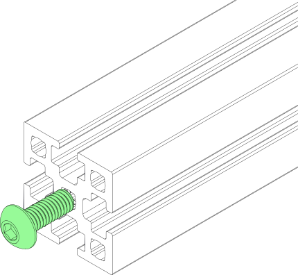
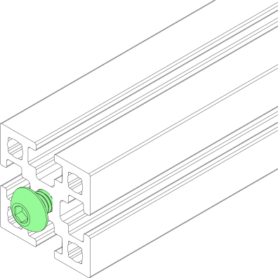
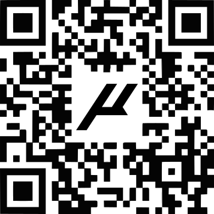
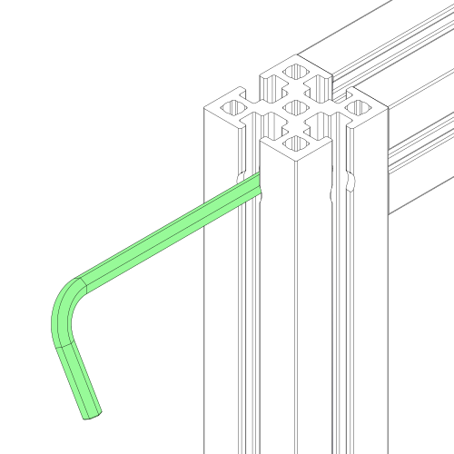
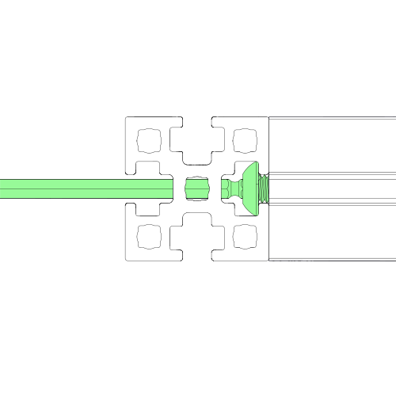

# EXTRUSIONS

### BLIND JOINTS

<strong class="image-text title">**BLIND JOINT BASICS**</strong>

Blind Joints provide a cost-effective and rigid assembly method. The head of the BHCS is slid into the channel of another extrusion and securely fastened through a small access hole in the extrusion. If you’ve never assembled one before we recommend you watch the linked guide by clicking or scanning below

<a class="aClick" href="https://voron.link/onjwmcd">

</a>

