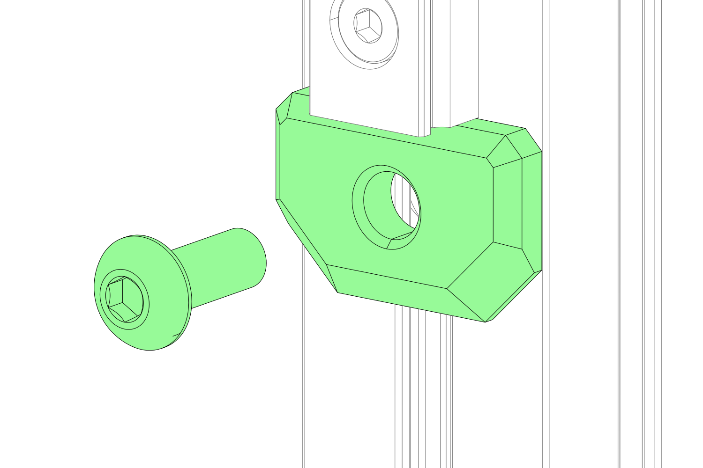

# Z AXIS

### RAILSTOPS

<!-- test 123  -->

<strong class="image-text title">**WHERE’S THE NUT!?**</strong>

The instructions won’t call out nuts that were inserted in a previous step, nor nuts that can be easily inserted in the current step. if a screw does NOT thread into a nut we will explicitly state this. You can assume that all screws that enter extrusion slots thread into a nut.

