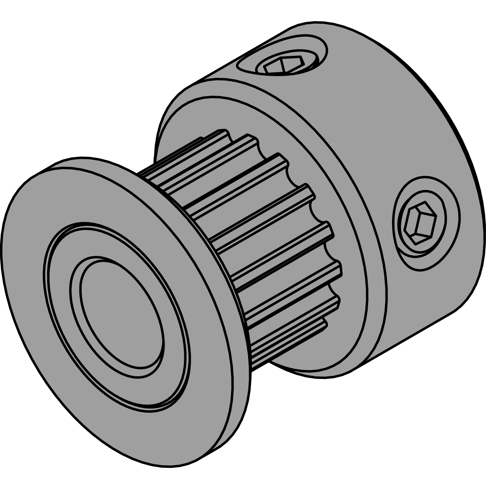
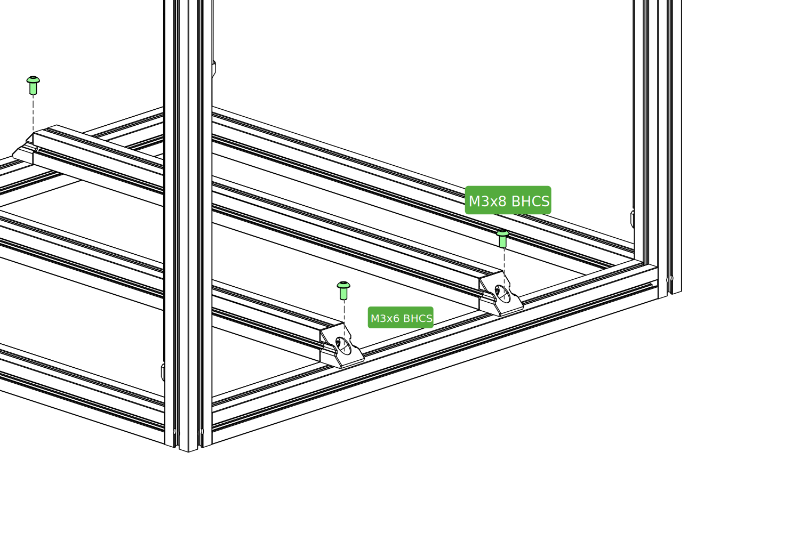

# SAMPLE PAGE SECTION

### SAMPLE SUBSECTION 1

GT2 Pulley

 
<strong class="image-text title">**TITLE 1**</strong>

Sample text Sample text Sample text Sample text Sample text Sample text Sample text Sample text Sample text Sample text Sample text Sample text 

 

###

GT2 Pulley

 
<strong class="image-text title">**TITLE 2**</strong>

Sample text Sample text Sample text Sample text Sample text Sample text Sample text Sample text Sample text Sample text Sample text Sample text 

 

### SAMPLE SUBSECTION 3

<strong class="image-text title">**TITLE 3**</strong>

Text goes hereText goes hereText goes hereText goes hereText goes hereText goes hereText goes hereText goes hereText goes here 

GT2 Pulley

### SAMPLE SUBSECTION 4

Z Drive

